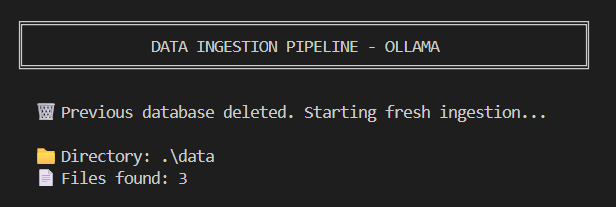
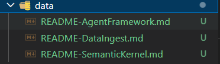
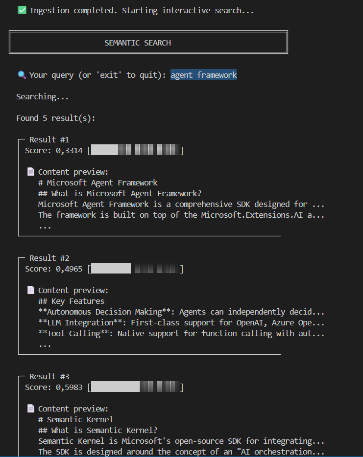

# DataIngest - Local RAG Pipeline

[](https://dotnet.microsoft.com/)
[](https://ollama.ai/)
[](https://github.com/asg017/sqlite-vec)
[](LICENSE)

> **100% Local** RAG pipeline for document ingestion. Your data never leaves your machine.

## Powered by `Microsoft.Extensions.DataIngestion`

This project is built on top of [**Microsoft.Extensions.DataIngestion**](https://www.nuget.org/packages/Microsoft.Extensions.DataIngestion), the new official .NET library from Microsoft that provides a **standardized, extensible pipeline for data ingestion in RAG (Retrieval-Augmented Generation) scenarios**.

`Microsoft.Extensions.DataIngestion` offers out-of-the-box abstractions for the complete ingestion workflow:

- **Document loading** — read documents from multiple sources via pluggable readers (including the [MarkItDown MCP](https://www.nuget.org/packages/Microsoft.Extensions.DataIngestion.MarkItDown) integration).
- **Semantic chunking** — split documents into meaningful chunks using token-aware strategies.
- **Enrichment** — augment chunks with metadata such as AI-generated summaries.
- **Embedding generation** — produce vector embeddings through any compatible provider (e.g., Ollama, OpenAI).
- **Vector storage** — persist embeddings into vector stores like SQLite + sqlite-vec via Semantic Kernel connectors.

By leveraging this library, DataIngest avoids reinventing the wheel and focuses on composing a **fully local, privacy-first pipeline** where every step — from parsing to search — runs on your machine.

---

Transform your documents into a searchable semantic knowledge base using **Ollama** for AI processing, **SQLite** for vector storage, and **MarkItDown MCP** for document conversion.

### SQLite & DataIngest



### Data Ingestion



### Semantic Search



## Features

| Feature | Description |
|---------|-------------|
| 🔒 **Privacy First** | All processing runs locally with Ollama |
| 🧠 **Semantic Chunking** | Intelligent document splitting based on meaning |
| 📝 **Auto-summarization** | AI-generated summaries for each chunk |
| 🔍 **Vector Search** | Fast semantic search with SQLite + sqlite-vec |
| 💻 **Interactive CLI** | Real-time search with relevance visualization |
| 🏗️ **Clean Architecture** | SOLID principles throughout |

## Architecture

```
┌─────────────────┐     ┌─────────────────┐     ┌─────────────────┐
│  .md Files      │────▶│  MarkItDown MCP │────▶│  Semantic       │
│  (./data)       │     │  (Docker:3001)  │     │  Chunker        │
└─────────────────┘     └─────────────────┘     └────────┬────────┘
                                                         │
                                                         ▼
┌─────────────────┐     ┌─────────────────┐     ┌─────────────────┐
│  Semantic       │◀────│  SQLite Vector  │◀────│  Ollama         │
│  Search         │     │  Store          │     │  Embeddings     │
└─────────────────┘     └─────────────────┘     └─────────────────┘
```

## Requirements

| Dependency | Version | Purpose |
|------------|---------|---------|
| [.NET SDK](https://dotnet.microsoft.com/) | 10.0+ | Runtime |
| [Ollama](https://ollama.ai/) | Latest | Local LLM inference |
| [Docker](https://docker.com/) | Latest | MarkItDown MCP server |

### Ollama Models

```bash
ollama pull qwen3:1.7b        # Chat & summarization (structured output support)
ollama pull nomic-embed-text  # Embeddings (768 dimensions)
```

## Quick Start

```bash
# 1. Start Ollama
ollama serve

# 2. Start MarkItDown MCP Server
docker run -p 3001:3001 mcp/markitdown --http --host 0.0.0.0 --port 3001

# 3. Add your documents to ./data/

# 4. Run
dotnet run
```

<details>
<summary>Alternative: MarkItDown via pip</summary>

```bash
pip install markitdown-mcp-server
markitdown-mcp --http --host 0.0.0.0 --port 3001
```
</details>

## Dependencies

```xml
<!-- Core pipeline -->
<PackageReference Include="Microsoft.Extensions.DataIngestion" Version="10.0.1-preview.1.25571.5" />
<PackageReference Include="Microsoft.Extensions.DataIngestion.MarkItDown" Version="10.0.1-preview.1.25571.5" />

<!-- Vector storage -->
<PackageReference Include="Microsoft.SemanticKernel.Connectors.SqliteVec" Version="1.67.1-preview" />

<!-- LLM client -->
<PackageReference Include="OllamaSharp" Version="5.4.16" />

<!-- Tokenization -->
<PackageReference Include="Microsoft.ML.Tokenizers.Data.Cl100kBase" Version="2.0.0" />
```

## Project Structure

```
dataingest/
├── src/
│   ├── Program.cs                      # Entry point & orchestration
│   ├── Configuration/
│   │   └── PipelineConfig.cs           # Centralized settings
│   ├── Services/
│   │   └── PipelineFactory.cs          # Component factory (DI)
│   └── UI/
│       └── ConsoleUI.cs                # Console interactions
├── data/                               # Input documents (.md files)
├── dataingest.csproj
└── README.md
```

### SOLID Principles Applied

| Component | Principle | Responsibility |
|-----------|-----------|----------------|
| `PipelineConfig` | SRP | Centralized configuration |
| `ConsoleUI` | SRP | User interface / console output |
| `PipelineFactory` | DIP, OCP | Component creation, dependency decoupling |
| `Program` | Composition Root | Orchestration only |

## Configuration

All settings in `src/Configuration/PipelineConfig.cs`:

```csharp
public record PipelineConfig
{
    public string OllamaEndpoint { get; init; } = "http://localhost:11434";
    public string ChatModel { get; init; } = "qwen3:1.7b";
    public string EmbeddingModel { get; init; } = "nomic-embed-text";
    public int EmbeddingDimensions { get; init; } = 768;
    public int MaxTokensPerChunk { get; init; } = 2000;
    public int OverlapTokens { get; init; } = 200;
    public TimeSpan HttpTimeout { get; init; } = TimeSpan.FromMinutes(5);
    public int TopResults { get; init; } = 5;
}
```

## How It Works

1. **Clean**: Any existing `vectors.db` is deleted automatically
2. **Read**: Documents loaded via MarkItDown MCP server
3. **Chunk**: Semantic splitting using embedding similarity
4. **Enrich**: Auto-generate summaries with LLM
5. **Store**: Embeddings saved to SQLite with sqlite-vec
6. **Search**: Interactive semantic search loop

> Each run performs a fresh ingestion to ensure data consistency.

## Troubleshooting

| Issue | Solution |
|-------|----------|
| Timeout errors | Increase `HttpTimeout` in config |
| MarkItDown connection refused | Check Docker: `docker ps \| grep markitdown` |
| First query slow | Normal - model loading into memory |

## Known Limitations

- **SummaryEnricher batch size**: `BatchSize` is set to 1 to ensure Ollama returns the correct number of summaries per chunk
- **Cold start latency**: First embedding takes longer as model loads

## Tech Stack

| Technology | Purpose |
|------------|---------|
| [.NET 10](https://dotnet.microsoft.com/) | Runtime & framework |
| [Ollama](https://ollama.ai/) | Local LLM inference |
| [Semantic Kernel](https://github.com/microsoft/semantic-kernel) | AI orchestration |
| [sqlite-vec](https://github.com/asg017/sqlite-vec) | Vector search |
| [MarkItDown](https://github.com/microsoft/markitdown) | Document conversion |

## License

[MIT](LICENSE) - See LICENSE file for details.

---

<p align="center">
  <sub>Built with ❤️ for local-first AI</sub>
</p>
